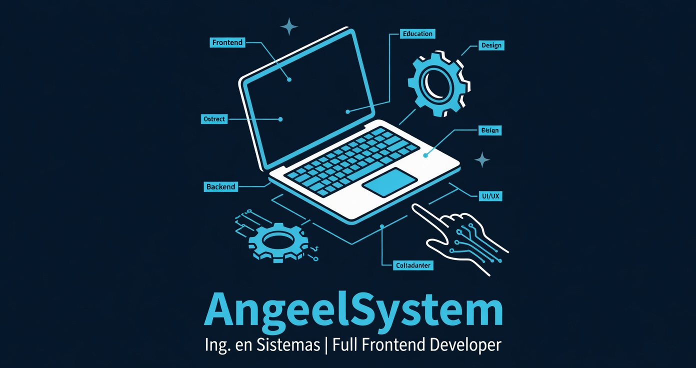

  

# Hey, I'm Ángel! 👋

* **I am a Full Frontend Developer from** México 🇲🇽
* **Visit my** https://angeelsystem.vercel.app/
* **Techstack:** `.js`, `.jsx`, `node`, `linux`, `git`
* **Founder of** Softix 💡
* **Married to** E 💕

---

## GitHub Stats & Languages 📊

---
### Tech Stack & Tools

<code></code>
<code></code>
<code></code>
<code></code>
<code></code>
<code></code>
<code></code>
---

### Connect with me

