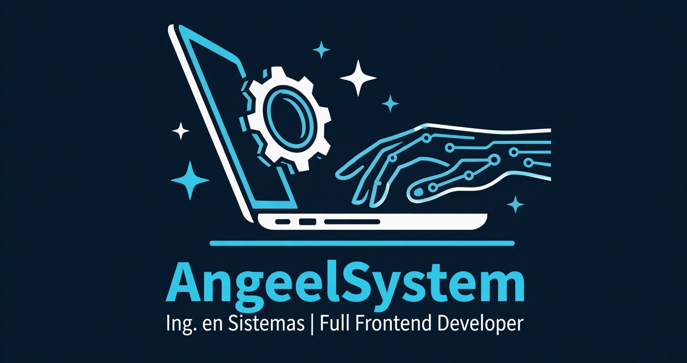

# 👋 Hey, I'm Ángel Valencia

### Frontend Developer | React • Next.js • TypeScript • México 🇲🇽

---

# 🚀 About Me

- 💻 Frontend Developer focused on modern web applications.
- ⚛️ Passionate about React, Next.js and TypeScript.
- 🌱 Currently learning Backend Architecture and Cloud.
- 🎯 Always looking to build clean, scalable and performant applications.

---

# 🔥 GitHub Streak

---

# 📊 GitHub Stats

---

# 📈 Activity Graph

---

# 🏆 GitHub Trophies

---

# 🛠 Tech Stack

---

# 🌎 Connect With Me

---

### ✨ Building modern web experiences, one project at a time.

